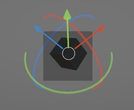

# RuntimePositioner3D

Translate, rotate and scale 3D objects in Unity runtime.

Tested with [Unity URP](https://docs.unity3d.com/6000.0/Documentation/Manual/universal-render-pipeline.html) and works only for the [new Input System](https://docs.unity3d.com/Packages/com.unity.inputsystem@1.11/manual/index.html).

## Install

1. Open the Package Manager from `Window > Package Manager`
2. `"+" button > Add package from git URL`
3. Enter the following
   * https://github.com/Augmencia/RuntimePositioner3D.git?path=/Packages/RuntimePositioner3D#1.0.1

Or, open `Packages/manifest.json` and add the following to the dependencies block.

```json
{
    "dependencies": {
         "com.augmencia.runtimepositioner3d": "https://github.com/Augmencia/RuntimePositioner3D.git?path=/Packages/RuntimePositioner3D#1.0.1"
    }
}
```

## Screenshots



## Contribute

If you find a bug or need a feature, feel free to open an issue.

The codebase is quite small, if you feel like coding what you need by yourself just open a pull request with the changes you would like to see integrated.

As long as the code remains simple and improves RuntimePositioner3D you can be assured it will be merged as soon as possible.

## Credits

3D models and the HandleShader are coming from https://github.com/manaporkun/UnityRuntimeTransformHandles
